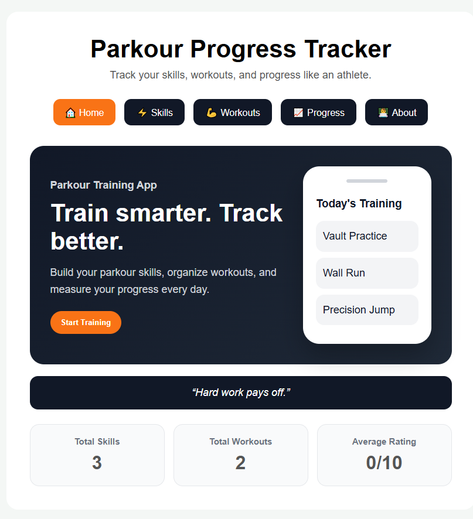
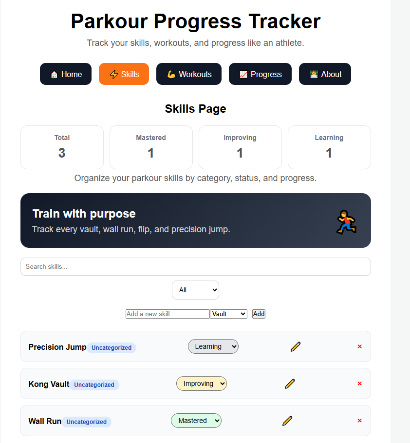
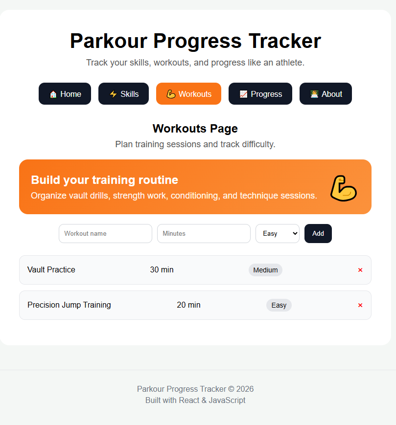
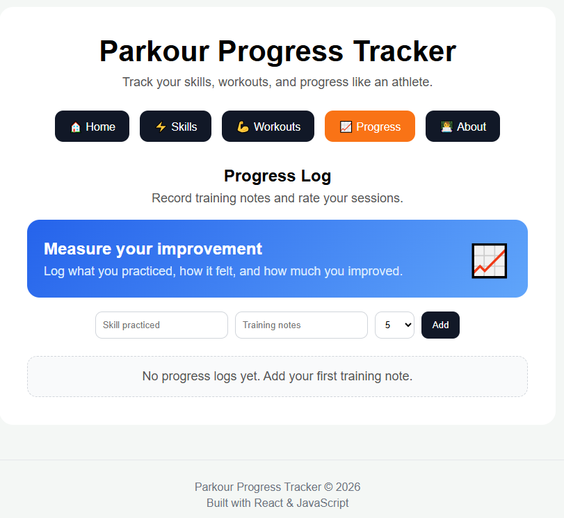

# Parkour Progress Tracker

A responsive React web application that helps athletes track parkour skills, workouts, and training progress in one place.

## Live Demo

https://parkour-progress-tracker.vercel.app/

## Features

* Create, edit, delete, search, and filter parkour skills
* Track skill status (Learning, Improving, Mastered)
* Manage workout sessions and difficulty levels
* Record training progress with notes and ratings
* Dashboard with dynamic statistics
* Persistent data storage using LocalStorage
* Responsive design for desktop and mobile devices

## Screenshots

### Home Page

### Skills Page

### Workouts Page

### Progress Page

## Tech Stack

* React
* JavaScript (ES6+)
* CSS3
* LocalStorage
* Git
* GitHub

## What I Learned

* React Components
* State Management with useState
* Side Effects with useEffect
* Props and Component Communication
* CRUD Operations
* Search and Filtering
* Conditional Rendering
* Responsive Web Design
* Git and GitHub Workflow

## Future Improvements

* User Authentication
* Node.js Backend API
* MongoDB Database
* User Profiles
* Video Uploads
* Progress Analytics Charts

## Author

Youssef Dalil

Computer Science Student at Calvin University

Interested in Software Engineering, Web Development, and Building Real-World Applications.
